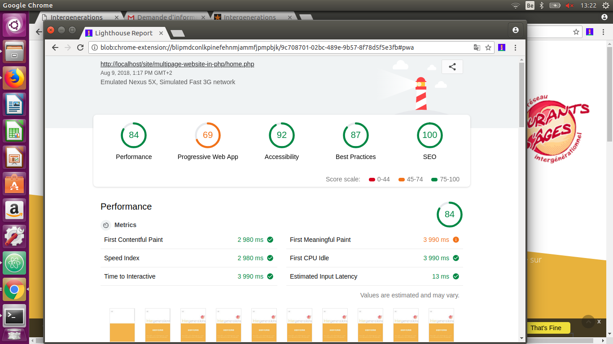

Projet  website multipages en php.
==================================
Projet soumis à un binome provenant de 2 formations différentes de _becode_.
 **Développeurs juniors**:
 Formation Lovelace 2 : **_Morgane Meganck_**.
 Formation Jhonson 2 : **_Ajay Shinde_**.

Déscription du projet.
----------------------
A partir d'un site existant, le repenser, avec une approche plus estétique et épurée, avec un minimum de 3 pages et un maximum de 5 pages.
 Il ne doit y avoir aucune repétion, les éléments  redondants doivent être sujet à l'inclusion (_include_).
 Y intégrer un formulaire fonctionel, dirigé vers notre propre boîte de messagerie (_gmail_).
 Le formulaire doit être sanitiser et le site hébergé sur **000webhost**, ainsi que déployé sur **Heroku**. 

**Technos utilisées.**
 Html, css, Js, php
 **Frameworks et template.**
 Bootstrap, pink donuts template de xs@mail.com.
 **Hébergement.**
 000webhost, Heroku.

